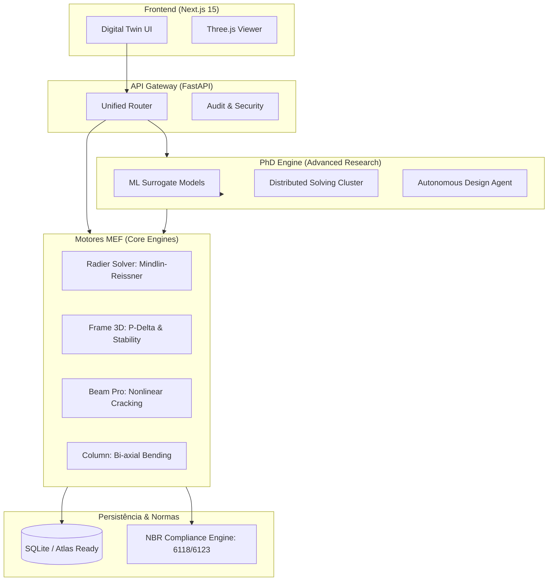

# 📘 Atlas Backend — Technical Research Briefing
**Versão:** 6.0.0-PHD (Elite Engineering Tier)
**Foco:** Pesquisa Estrutural, IA Aplicada e Computação Distribuída

---

## 1. Visão Geral da Arquitetura
O Atlas é um ecossistema de cálculo estrutural "Headless", onde o backend em Python (FastAPI) atua como um hub de motores de elementos finitos (FEM) independentes, orquestrados por uma camada de inteligência autônoma.

### 🏗️ Diagrama de Arquitetura (Atlas Engine)

---

## 2. Motores de Elementos Finitos (FEM)
O backend implementa formulações avançadas para garantir precisão científica:

*   **Radier e Lajes (`RadierSolverM4`)**: Utiliza a Teoria de Placas de **Mindlin-Reissner** (considerando deformação por cortante), modelando o solo como base elástica de **Winkler** com tratamento *tensionless* (não-linearidade de contato).
*   **Póortico 3D (`Frame3DEngine`)**: Realiza análise matricial tridimensional com efeitos de 2ª ordem via **P-Delta Iterativo**, calculando o coeficiente de estabilidade global $\gamma_z$.
*   **Vigas Pro (`BeamSolverM4`)**: Implementa a não-linearidade física através da inércia efetiva (**Modelo de Branson**) para cálculo de flechas reais e redistribuição plástica limitada.

---

## 3. PhD Intelligence Layer (Área de Pesquisa)
Este é o diferencial para pesquisadores, onde o Atlas vai além do cálculo tradicional:

*   **ML Surrogate Models**: Modelos de Machine Learning treinados para predizer respostas estruturais (recalques e momentos) em milissegundos, permitindo estudos de sensibilidade ultra-rápidos.
*   **Cluster de Resolução Distribuída**: O sistema está preparado para particionar grandes sistemas de equações (1M+ graus de liberdade) para resolução paralela.
*   **Agente de Design Autônomo**: Um algoritmo de otimização heurística que itera sobre a geometria para encontrar o custo mínimo atendendo a todos os limites normativos.

---

## 4. Conformidade Normativa (Auditabilidade)
Todo o backend é "norma-aware", garantindo que a pesquisa esteja alinhada com a prática profissional brasileira:
*   **NBR 6118:2023**: Dimensionamento de concreto armado (ELU/ELS).
*   **NBR 6123**: Geração automática de forças de vento estáticas e dinâmicas.
*   **NBR 8681**: Automatização de envoltórias e combinações de ações.

---

## 5. Persistência e Dados
A arquitetura de dados segue o princípio **Cloud-Ready**:
*   **Identificadores**: Uso de UUIDs para evitar colisões em ambientes distribuídos.
*   **Snapshots**: Cada cálculo gera um "Snapshot" completo (Payload + Resultados), permitindo auditoria forense de qualquer etapa do projeto.
*   **Sync**: Preparado para sincronização com MongoDB Atlas para colaboração global em tempo real.

---
*Este documento foi gerado para fins de auditoria e pesquisa técnica. 2026-05-09*
