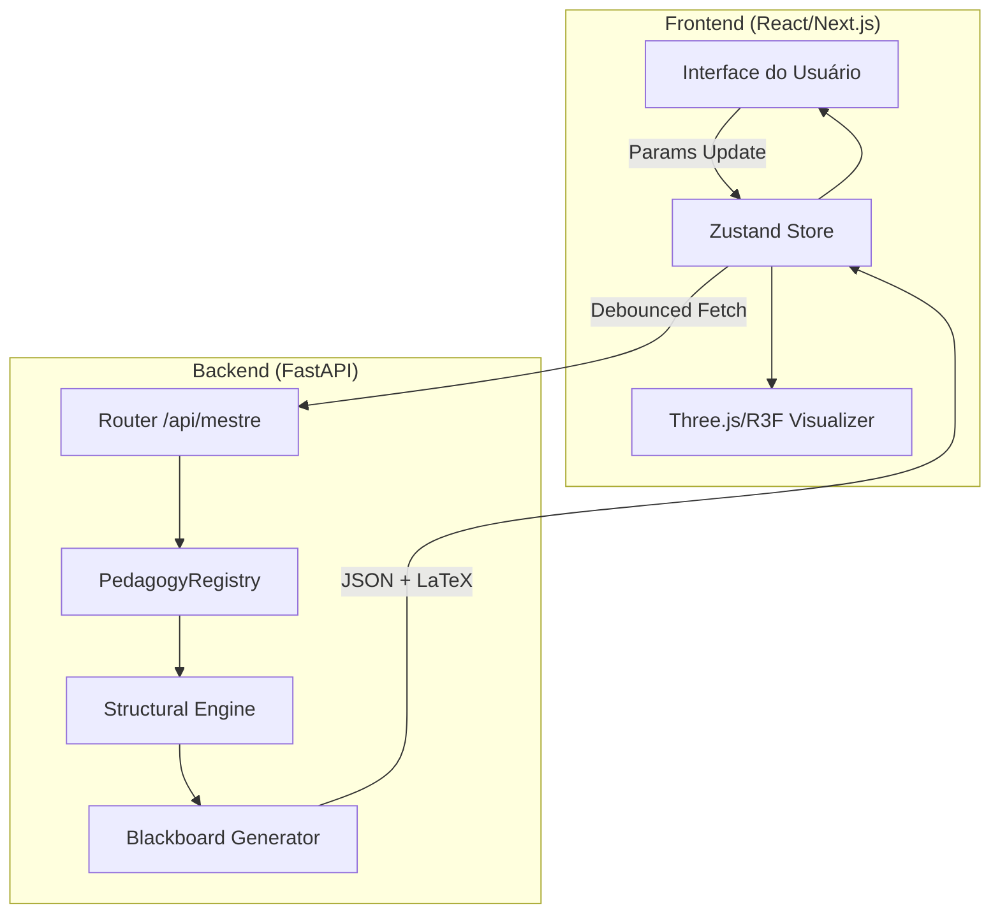

# MEF STRUCTURAL — Documentação Técnica (v6.2.0-ELITE)

Bem-vindo à documentação oficial do **MEF STRUCTURAL**, uma plataforma de alta fidelidade para análise e dimensionamento de estruturas, integrando engenharia de precisão com uma experiência de usuário premium estilo macOS.

---

## 1. Arquitetura do Sistema

O sistema é baseado em uma arquitetura desacoplada, onde o motor de cálculo (Python/FastAPI) atua como um oráculo de engenharia para um frontend reativo (Next.js 15).

### 1.1 Stack Tecnológica
- **Frontend**: Next.js 15, Tailwind CSS, shadcn/ui, Zustand, Three.js.
- **Backend**: FastAPI, NumPy/SciPy (Matemática), Rust/Rayon (Performance), Uvicorn.
- **Renderização Matemática**: KaTeX (via ReactMarkdown + rehype-katex).

---

## 2. Atlas Mestre: Fluxo Pedagógico

O **Atlas Mestre** é projetado para transformar cálculos estruturais complexos em memoriais passo-a-passo ("Blackboards").

### 2.1 Gestão de Estado (Zustand)
O `store-mestre.ts` centraliza a verdade do aplicativo:
- `params`: Objeto reativo contendo Nd, geometria, materiais, etc.
- `pedagogicalSteps`: Array de objetos contendo `title`, `formula`, `substitution`, `result` e `explanation`.
- `isLoading`: Flag de sincronia com o motor.

### 2.2 Padronização de Layout (UI Patterns)
Após a versão v6.2, adotamos o padrão **Vertical Clean Layout**:
- **Painel Esquerdo (500px max)**: Controles agrupados verticalmente para evitar sobreposição em telas menores ou sidebars.
- **HUD Superior**: Visualização 3D em tempo real sincronizada com os inputs.
- **Centro/Direita**: O "Blackboard" — um memorial de cálculo expansível que serve como roteiro de auditoria para a norma.

---

## 3. Guia de Implementação (Engine)

### 3.1 Adicionando um Novo Elemento
Para adicionar um novo elemento pedagógico (ex: *Muro de Arrimo*):

1. **Backend (`mef_engine`)**:
   - Desenvolver o solver em `special_elements.py`.
   - Criar o gerador de blackboard em `reporting/pedagogy/retaining_wall.py`.
   - **IMPORTANTE**: A função deve seguir a assinatura `build_blackboard(res, payload=None)`.
   - Registrar no `PedagogyRegistry` em `master_pedagogy.py`.

2. **Frontend (`mef_frontend`)**:
   - Adicionar o ID `retaining_wall` no `MestreSidebar.tsx`.
   - Criar `RetainingWallPlayground.tsx` usando o componente `Input` padrão e o padrão de seções verticais.
   - Integrar no `page.tsx` do diretório `/mestre`.

---

## 4. Design System & Estética

O Atlas utiliza o conceito de **Glassmorphism** e **Vibrancy** nativo do macOS:
- `.macos-vibrancy`: Backdrop blur de 20px com opacidade variável.
- `.macos-button`: Botões com sombra suave e feedback tátil de escala.
- `.glass-panel`: Painéis semi-transparentes para overlays e memoriais.

---

## 5. Resolução de Problemas (Troubleshooting)

| Sintoma | Causa Provável | Solução |
| :--- | :--- | :--- |
| `ERR_CONNECTION_REFUSED` | Servidor Backend (FastAPI) offline. | `cd mef_engine && python main.py` |
| Valores zerados no memorial | Inconsistência de schema JSON. | Verificar se as chaves no `payload` do frontend batem com o `params` no backend. |
| LaTeX não renderiza | Fórmulas sem delimitadores `$$` ou `$`. | Garantir que o backend envie strings no formato `\frac{A}{B}`. |
| Componentes "espremidos" | Grid horizontal em container estreito. | Migrar o componente para o padrão `Vertical Section` do Atlas v6.2. |

---

## 6. Normas e Auditoria
O sistema realiza auditoria em tempo real baseada nas seguintes diretrizes:
- **NBR 6118:2023**: Dimensionamento de concreto armado.
- **NBR 6122:2022**: Fundações.
- **NBR 6120:2019**: Critérios de carregamento.

---
*Documentação técnica mantida pelo Atlas Engineering Core. Última atualização: Maio/2026.*
