# Comparativo de Performance e Recursos: MEF Structural vs. Softwares de Mercado

Este documento apresenta uma análise comparativa técnica e funcional entre o **MEF Structural** e as ferramentas mais consolidadas do mercado nacional e internacional: **TQS**, **AltoQi Eberick**, **CYPECAD**, **SAP2000** e **Autodesk Robot Structural Analysis**.

---

## 1. Visão Geral Comparativa (Gráfico de Capacidades)

Abaixo está uma representação visual do nível de maturidade e foco de cada software em 5 pilares críticos:
1. **NBR Compliance** (Conformidade estrita com NBR 6118:2023 e NBR 6122:2022)
2. **RBDO / Confiabilidade** (Cálculo probabilístico de índice de confiabilidade $\beta$ via Monte Carlo)
3. **Otimização de Custos** (Algoritmo genético integrado que busca menor custo financeiro direto)
4. **Interação Solo-Estrutura (SSI)** (Acoplamento dinâmico de Winkler e coeficientes variáveis)
5. **Velocidade de Iteração** (Tempo de resposta para re-cálculos e otimizações)

```mermaid
radar-chart
    title Comparativo de Pilares Estruturais (Escala 0-10)
    labels ["NBR Compliance", "RBDO / Confiabilidade", "Otimização de Custos", "Interação Solo-Estrutura", "Velocidade de Iteração"]
    "MEF Structural": [9, 10, 10, 9, 9]
    "TQS / Eberick": [10, 1, 4, 8, 3]
    "CYPECAD": [9, 1, 3, 7, 4]
    "SAP2000 / Robot": [6, 3, 5, 8, 5]
```

---

## 2. Matriz Comparativa Detalhada

| Métrica / Recurso | MEF Structural | TQS / Eberick (Nacional) | CYPECAD (Ibérico/Nacional) | SAP2000 / Robot (Global) |
| :--- | :---: | :---: | :---: | :---: |
| **Filosofia de Segurança** | Probabilística (RBDO) + Determinística | Determinística (Coeficientes $\gamma$) | Determinística (Coeficientes $\gamma$) | Determinística (Alguns módulos LRFD) |
| **Otimização Principal** | Custo Financeiro Direto (BRL) | Consumo de Aço/Volume (Manual) | Geometria de Sapatas | Dimensionamento Automático de Perfis |
| **Cálculo de Confiabilidade ($\beta$)** | **Sim (Monte Carlo Nativo)** | Não | Não | Apenas via plugins terceiros pesados |
| **Simulação Solo-Estrutura** | Pseudo-acoplada Iterativa + Rigidez Variável | Coeficientes de mola estáticos | Coeficientes de mola estáticos | Elementos de Link e Molas não lineares |
| **Velocidade do Otimizador** | Sub-segundo (Malha adaptativa) | Minutos (Processamento Global) | Médio | Lento para otimizações complexas |
| **Curva de Aprendizado** | Baixa (Foco em Decisão Executiva / API) | Altíssima (Muitos parâmetros) | Média/Alta | Altíssima (Software Geralista) |

---

## 3. Análise dos Indicadores Chave (KPIs)

### 3.1. Índice de Confiabilidade ($\beta$) vs. Fator de Segurança Tradicional
Enquanto os softwares tradicionais aplicam coeficientes parciais de segurança fixos ($\gamma_f = 1.4$ e $\gamma_c = 1.4$), o **MEF Structural** calcula dinamicamente a probabilidade de falha estrutural real baseada nas incertezas geotécnicas e de carregamento.

```mermaid
gantt
    title Filosofia de Dimensionamento e Gestão de Riscos
    dateFormat  X
    axisFormat %s
    section Tradicional (Eberick/TQS)
    Coeficientes Estáticos (NBR) : 0, 10
    Zona de Margem Cega (Incerteza não medida) : 10, 15
    section MEF Structural (RBDO)
    Calibração Inversa de Rigidez : 0, 5
    Análise Probabilística de Monte Carlo : 5, 12
    Cálculo Real do Índice Beta (Beta >= 2.5) : 12, 15
```



### 3.2. Velocidade de Processamento em Ciclos de Otimização
Para rodar 40 iterações de dimensionamento de espessura de Radier:
* **Softwares Gerais (SAP2000/Robot):** Exigem scripts externos (API COM/Python), levando cerca de **5 a 15 minutos** por conta da malha pesada.
* **Softwares Comerciais (TQS/Eberick):** Exigem reanálise manual de todo o edifício, levando de **10 a 30 minutos**.
* **MEF Structural:** Utiliza malhas dinâmicas simplificadas no loop genético e resolve o sistema em **menos de 20 segundos**, trazendo a resposta ideal instantaneamente.

```mermaid
bar
    title Tempo de Execução para 40 Iterações (Segundos)
    xlabel "Tempo em segundos (Menor é melhor)"
    "MEF Structural (Otimizado)" : 16
    "CYPECAD (Manual/Iterativo)" : 900
    "TQS / Eberick (Manual/Iterativo)" : 1200
    "SAP2000 (Via API COM)" : 600
```

---

## 4. Onde o MEF Structural se Diferencia (A Proposta de Valor Única)

Como discutido, **nosso objetivo não é concorrer diretamente na geração de pranchas de detalhamento de armaduras complexas de edifícios inteiros**, mas sim fornecer uma **Camada de Inteligência e Otimização Financeira/Probabilística** que esses softwares não possuem:

1. **Apoio à Decisão Executiva (Pre-Design):** Encontrar a espessura e FCK ótimos antes de lançar o modelo final no TQS/Eberick.
2. **Auditoria de Projetos (Peer Review):** Validar se um projeto superdimensionado por outro software pode ser reduzido com segurança com base no índice $\beta$ real.
3. **Quantificação de Incerteza (UQ):** Considerar a variabilidade estatística do solo (Winkler) de forma automatizada.
