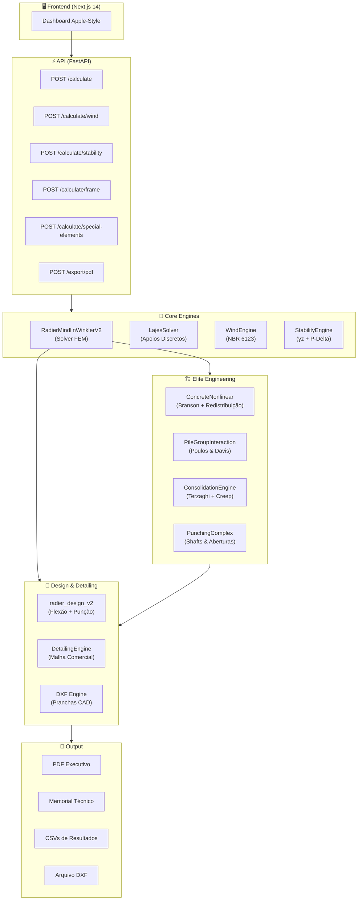

# MEF STRUCTURAL — Plataforma de Análise Estrutural por Elementos Finitos

<p align="center">
  <strong>V3.1.0 "Elite Engineering"</strong> · Solver Mindlin-Reissner · NBR 6118/6122/6123 · Python 3.11+
</p>

---

## Visão Geral

**MEF STRUCTURAL** é uma plataforma profissional de análise estrutural por Método dos Elementos Finitos (MEF), projetada para **dimensionamento, perícia e pesquisa aplicada** de fundações e estruturas de concreto armado. O sistema integra solver de placas grossas, geotecnia avançada, análise de vento, estabilidade global, e geração automática de artefatos de engenharia (CAD, PDF, memoriais).

### Capacidades Principais

- **Radier** — Análise de radiers lisos e estaqueados com placas de Mindlin-Reissner sobre solo de Winkler
- **Lajes** — Solver de lajes sobre apoios discretos (pilares e paredes) com momento por faixas
- **Vento** — Análise estática e dinâmica conforme NBR 6123 com efeitos ressonantes
- **Estabilidade** — Coeficiente γz e P-Delta iterativo para edifícios altos
- **Pórticos 3D** — Integração com StrucPy para análise global de estruturas

---

## Arquitetura



---

## Módulos

### 🔧 Solver Core

| Módulo | Arquivo | Linhas | Descrição |
|:---|:---|---:|:---|
| **Solver Mindlin-Reissner** | `radier_solver_v2.py` | 514 | Placa grossa Q4 sobre solo de Winkler com tensionless, elasto-plástico e estacas |
| **Solver Lajes** | `lajes_solver.py` | 438 | Derivação do solver para lajes sobre apoios discretos (pilares/paredes) |
| **Pipeline Radier** | `radier_lab_v24.py` | 620 | Orquestrador: FEM → Design → Detalhamento → Memorial |
| **Pipeline Lajes V1** | `laje_lab_v1.py` | 202 | Orquestrador simplificado para lajes |
| **Pipeline Lajes V2** | `laje_lab_v2.py` | 165 | Pipeline integrado com StrucPy |

### 📐 Design e Dimensionamento

| Módulo | Arquivo | Linhas | Descrição |
|:---|:---|---:|:---|
| **Design V2** | `radier_design_v2.py` | 543 | Flexão (Wood-Armer), Punção (NBR 6118 §19.5), Fissuração (ELS-W), Distorção Angular |
| **Detalhamento** | `radier_detailing.py` | 65 | Conversão $cm^2/m$ → bitola + espaçamento comercial |
| **Engine DXF** | `dxf_engine.py` | 106 | Geração de pranchas CAD com camadas normativas |

### 🏗️ Elite Engineering (V3.1.0)

| Módulo | Arquivo | Linhas | Descrição |
|:---|:---|---:|:---|
| **Não-Linearidade Física** | `concrete_nonlinear.py` | 247 | Branson (I_eff), classificação Estádio I/II/III, redistribuição plástica δ |
| **Grupo de Estacas** | `pile_group_interaction.py` | 203 | Interação Poulos & Davis / Randolph & Wroth, eficiência η |
| **Adensamento** | `consolidation_engine.py` | 245 | Terzaghi 1D (Fourier), recalque primário + secundário (creep) |
| **Punção Complexa** | `punching_complex.py` | 265 | Dedução de perímetro C' por shafts, furos e recortes |

### 🌍 Geotecnia

| Módulo | Arquivo | Linhas | Descrição |
|:---|:---|---:|:---|
| **Solo Heterogêneo** | `radier_geotechnics.py` | 207 | Interpolação de $k_v$ a partir de SPT, solo estratificado |
| **Matriz de Referência** | `radier_geotech_reference_matrix.py` | 235 | Tabela de correlações SPT × tipo de solo × $k_v$ |
| **Motor de Estacas** | `piles_engine.py` | 50 | Rigidez axial (EA/L) e verificação de capacidade |
| **SSI Pseudo-Acoplado** | `ssi_engine.py` | 100 | Iteração solo-estrutura com convergência por recalque |
| **SSI Avançado** | `ssi_advanced.py` | 65 | Locking Effect: rigidez da superestrutura na matriz global |

### 🌀 Ações e Estabilidade

| Módulo | Arquivo | Linhas | Descrição |
|:---|:---|---:|:---|
| **Vento NBR 6123** | `wind_engine.py` | 158 | S1/S2/S3 estático + modelo discreto dinâmico (Cap. 9) |
| **Estabilidade Global** | `stability_engine.py` | 124 | γz, P-Delta iterativo, aceleração de conforto |
| **Otimizador** | `structural_optimizer.py` | 60 | Otimização de custo (aço + concreto) para seções |

### 📄 Reportagem e Auditoria

| Módulo | Arquivo | Linhas | Descrição |
|:---|:---|---:|:---|
| **API REST** | `api.py` | 1358 | FastAPI com 11 endpoints, CORS, validação Pydantic |
| **Memorial** | `radier_memorial.py` | 642 | JSON de auditoria com rastreabilidade normativa |
| **Relatório Markdown** | `radier_reporting.py` | 717 | Relatório técnico + guia didático |
| **PDF Executivo** | `radier_pdf.py` | 615 | PDF com capa go/no-go, KPIs, checklist |
| **Comparativo Analítico** | `radier_analytical.py` | 120 | MEF vs. método rígido simplificado |

### 🧪 Validação e Testes

| Módulo | Arquivo | Descrição |
|:---|:---|:---|
| **Regressão Completa** | `radier_regression_tests_v2.py` | 381 linhas de testes automatizados |
| **Validação SSI** | `verify_advanced_ssi.py` | Benchmark de travamento da superestrutura |
| **Validação Fissuração** | `verify_concrete_cracking.py` | Teste de redução de rigidez por Branson |
| **Validação P-Delta** | `verify_p_delta.py` | Convergência do solver iterativo |
| **Validação Estacas** | `verify_piled_raft.py` | Radier estaqueado vs. superficial |
| **Skyscraper 40 andares** | `verify_skyscraper_40.py` | Simulação de edifício alto completa |

---

## Instalação

```bash
# Clonar o repositório
git clone <repo-url>
cd "MEF STRUCTURAL/radier_lab"

# Criar e ativar ambiente virtual
python3 -m venv .venv
source .venv/bin/activate

# Instalar dependências
pip install -r requirements.txt

# Dependências opcionais (Elite Engineering)
pip install ezdxf    # Para geração de DXF
```

### Dependências

| Pacote | Versão | Uso |
|:---|:---|:---|
| `numpy` | ≥1.24 | Álgebra linear, matrizes de rigidez |
| `pandas` | ≥2.0 | DataFrames de resultados |
| `scipy` | ≥1.10 | Delaunay, interpolação, otimização |
| `fastapi` | ≥0.100 | API REST |
| `uvicorn` | ≥0.22 | Servidor ASGI |
| `pydantic` | ≥2.0 | Validação de dados |
| `fpdf2` | ≥2.7 | Geração de PDF |
| `ezdxf` | ≥1.0 | Geração de DXF (opcional) |

---

## Uso Rápido

### Via Pipeline Python

```python
from radier_lab_v24 import LabConfig, run_full_pipeline_demo

# Configuração padrão (radier 24x24m, 9 pilares, h=0.70m)
config = LabConfig()
result = run_full_pipeline_demo(config)

# Habilitar Elite Engineering
config_elite = LabConfig(
    h=1.20,
    fck=35.0,
    concrete_nonlinear=True,          # Branson + fissuração
    moment_redistribution=True,       # Redistribuição plástica
    advanced_ssi_enabled=True,        # Locking Effect (40 andares)
    consolidation_enabled=True,       # Adensamento temporal
    consolidation_delta_sigma_kPa=80, # Acréscimo de tensão
)
result = run_full_pipeline_demo(config_elite)
```

### Via API REST

```bash
# Iniciar o servidor
uvicorn api:app --host 0.0.0.0 --port 8000

# Calcular um radier
curl -X POST http://localhost:8000/calculate \
  -H "Content-Type: application/json" \
  -d '{
    "Lx": 32.5,
    "Ly": 24.8,
    "h": 1.15,
    "kv": 22100000,
    "fck": 30,
    "pillars": [
      {"id": "P1", "x": 5, "y": 5, "p_kN": 3000, "bx": 0.5, "by": 0.5},
      {"id": "P2", "x": 16, "y": 12, "p_kN": 5000, "bx": 0.7, "by": 0.7}
    ]
  }'
```

---

## API REST — Endpoints

| Método | Rota | Descrição |
|:---|:---|:---|
| `GET` | `/` | Status e versão da API |
| `POST` | `/calculate` | Análise completa de radier ou laje |
| `POST` | `/calculate/wind` | Análise de vento NBR 6123 com perfil de pressão, força por nível e momento na base |
| `POST` | `/calculate/wind-stability` | Acoplamento vento + estabilidade global (γz, P-Delta e conforto) |
| `POST` | `/calculate/stability` | Estabilidade global (γz + P-Delta) |
| `POST` | `/calculate/frame` | Análise de pórtico 3D (StrucPy) |
| `POST` | `/calculate/special-elements` | Escadas e reservatórios |
| `POST` | `/calculate_v2_unified` | Pipeline unificado (pórtico + radier) |
| `POST` | `/export/pdf` | Geração de PDF executivo |
| `POST` | `/estimate_loads` | Estimativa de cargas por pavimento |
| `POST` | `/optimize_design` | Otimização de custo |
| `POST` | `/optimize/structural` | Otimização estrutural avançada |
| `POST` | `/check/compliance` | Verificação de durabilidade (NBR 6118) |
| `GET` | `/report/diagrams/{id}` | Diagramas de esforços de membro |

---

## Fundamentação Teórica

### Solver de Placas (Mindlin-Reissner)

O solver utiliza elementos **Q4 (quadrilateral de 4 nós)** com **3 graus de liberdade por nó** ($w$, $\theta_x$, $\theta_y$), incluindo deformação por cisalhamento transversal (teoria de placas grossas), essencial para radiers com $h/L > 1/20$.

$$
\mathbf{K} = \int_\Omega (\mathbf{B}_b^T \mathbf{D}_b \mathbf{B}_b + \mathbf{B}_s^T D_s \mathbf{B}_s) \, d\Omega
$$

Onde:
- $\mathbf{D}_b$ = matriz constitutiva de flexão ($Eh^3/12(1-\nu^2)$)
- $D_s$ = rigidez ao cisalhamento ($\kappa G h$, $\kappa = 5/6$)
- Integração: Gauss 2×2

### Solo de Winkler

Molas verticais independentes com:
- **Tensionless**: desativação de molas com tração ($w < 0$)
- **Elasto-plástico**: limitação de pressão ($q_{soil} \leq q_{limit}$)
- **Heterogêneo**: mapa $k_v$ interpolado via SPT

### Não-Linearidade Física (NBR 6118 §14.6.4)

1. **Branson**: $I_{eff} = (M_r/M)^3 \cdot I_g + [1 - (M_r/M)^3] \cdot I_{cr}$
2. **Redistribuição**: $\delta \leq 25\%$ para elementos com $x/d \leq 0.45$

### Punção (NBR 6118 §19.5)

- Perímetro crítico $C'$ a $2d$ da face do pilar
- Fator $\beta$ com módulo de resistência plástica $W_p$
- Classificação automática: interior / borda / canto
- **Complexa**: dedução por aberturas conforme tangentes radiais

### Adensamento (Terzaghi 1D)

$$
U(T_v) = 1 - \sum_{m=0}^{\infty} \frac{2}{M^2} e^{-M^2 T_v}
$$

Com recalque secundário: $S_s = C_\alpha \cdot H \cdot \log_{10}(t/t_p)$

### Efeito de Grupo (Randolph & Wroth)

$$
\alpha_{ij} = \frac{\ln(r_m / s)}{\ln(r_m / r_0)}
$$

Onde $r_m = 2.5 L (1-\nu)$ é o raio de influência máximo.

---

## Artefatos de Saída

Cada execução do pipeline gera os seguintes artefatos no diretório `output/`:

| Artefato | Formato | Conteúdo |
|:---|:---|:---|
| `*_deterministic_summary.json` | JSON | Recalques, pressões, momentos |
| `*_reinforcement_metrics.json` | JSON | Consumo de aço (kg/m³) |
| `*_redistribution.json` | JSON | Diagnóstico da redistribuição plástica |
| `*_consolidation.json` | JSON | Curva recalque × tempo |
| `*_pile_group.json` | JSON | Eficiência η e classificação |
| `*_complex_punching.json` | JSON | Dedução de perímetro por aberturas |
| `*_memorial_summary.json` | JSON | Memorial de auditoria completo |
| `radier_v2_elements.csv` | CSV | Momentos por elemento |
| `radier_v2_nodes.csv` | CSV | Deslocamentos nodais |
| `radier_design_flexure_v2.csv` | CSV | Armaduras calculadas ($cm^2/m$) |
| `*_detailing.dxf` | DXF | Prancha CAD com armaduras |
| `*_report.pdf` | PDF | Relatório executivo com capa go/no-go |

---

## Normas Implementadas

| Norma | Aplicação |
|:---|:---|
| **NBR 6118:2023** | Concreto armado: flexão, punção, fissuração, γz, NLF |
| **NBR 6122:2019** | Fundações: recalque admissível, distorção angular, estacas |
| **NBR 6123:1988** | Vento: S1/S2/S3, pressão dinâmica, efeitos ressonantes |
| **NBR 8681:2003** | Combinações de ações (ELU/ELS) |

---

## Métricas do Projeto

| Métrica | Valor |
|:---|---:|
| Linhas de código Python | **10.377** |
| Módulos Python | **47** |
| Endpoints da API | **13** |
| Normas implementadas | **4** |
| Testes de validação | **6 scripts** |
| Versão atual | **V3.1.0** |

---

## Estrutura de Diretórios

```
radier_lab/
├── api.py                          # API REST (FastAPI)
├── main.py                         # Entry point
├── radier_lab_v24.py               # 🎯 Orquestrador principal
│
├── radier_solver_v2.py             # Solver Mindlin-Reissner Q4
├── radier_solver_v21.py            # Batch & Sensibilidade
├── radier_solver_v22.py            # Calibração Inversa & UQ
├── radier_solver_v23.py            # Calibração Bayesiana
├── lajes_solver.py                 # Solver de Lajes
│
├── radier_design_v2.py             # Flexão + Punção + Fissuração
├── radier_detailing.py             # Malha comercial (φ × esp.)
├── dxf_engine.py                   # Pranchas CAD (.dxf)
│
├── concrete_nonlinear.py           # ⭐ Branson + Redistribuição
├── consolidation_engine.py         # ⭐ Terzaghi + Creep
├── pile_group_interaction.py       # ⭐ Poulos & Davis
├── punching_complex.py             # ⭐ Shafts & Aberturas
│
├── ssi_engine.py                   # SSI Pseudo-Acoplado
├── ssi_advanced.py                 # SSI Locking Effect
├── piles_engine.py                 # Estacas (K = EA/L)
│
├── radier_geotechnics.py           # Solo heterogêneo (SPT)
├── radier_geotech_reference_matrix.py
│
├── wind_engine.py                  # Vento NBR 6123
├── stability_engine.py             # γz + P-Delta
├── structural_optimizer.py         # Otimização de custo
├── durability_checker.py           # Durabilidade NBR 6118
├── special_elements.py             # Escadas & Reservatórios
│
├── unified_pipeline.py             # Pórtico + Radier
├── strucpy_adapter.py              # Adaptador StrucPy
│
├── radier_memorial.py              # Memorial de auditoria
├── radier_reporting.py             # Relatório Markdown
├── radier_pdf.py                   # PDF Executivo
├── radier_analytical.py            # Comparativo analítico
│
├── radier_validation.py            # Validação de inputs
├── radier_utils.py                 # Utilitários (I/O JSON)
├── standards_profiles.py           # Perfis normativos
│
├── verify_*.py                     # Scripts de validação
├── radier_regression_tests_v2.py   # Testes de regressão
│
├── requirements.txt
├── atualizaçoes do projeto.md      # Log de versões
└── output/                         # Artefatos gerados
```

---

## Histórico de Versões

| Versão | Data | Destaque |
|:---|:---|:---|
| **V3.1.0** | 2026-05-03 | Elite Engineering: Redistribuição, Grupo de Estacas, Adensamento, Punção Complexa |
| **V3.0.0** | 2026-05-03 | SSI Avançado, DXF Automático, Memorial de Auditoria |
| **V2.6.0** | 2026-04-24 | Fechamento do módulo: Mapa de Pressões, Comparador, PDF Executivo |
| **V2.5.3** | 2026-04-24 | Decisão Executiva Go/No-Go |
| **V2.5.0** | 2026-04-22 | Punção NBR 6118:2023, Distorção Angular, Heatmaps |
| **V2.4.0** | 2026-04-22 | Comparativo Analítico MEF vs. Rígido |
| **V2.3.0** | 2026-04-15 | Calibração Bayesiana |
| **V2.0.0** | 2026-03-30 | Solver Mindlin-Reissner V2, pilares com dimensões reais |

---

## Licença

Uso interno — Propriedade de **VibeDoCode / Elyc Barros**.

---

<p align="center">
  <em>MEF STRUCTURAL V3.1.0 — Engenharia de Fundações com Rigor Científico</em>
</p>
